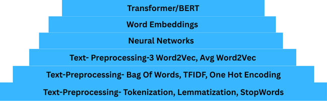
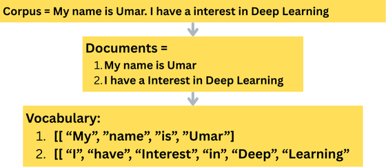
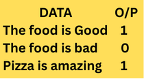
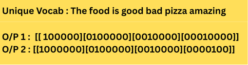

# NLP
# ROADMAP 

### Text PreProcessing using NLTK PART 1 
- Tokenization
- Stemming (Porter,RegexpStemmer, Snowball Stemmer)
- Lemmatizer
- Stop Words

#### 1. Tokenization 

#### 2. Stemming
Taking a word and Reducing it to its Word Stem
[eating,eaten,ate] ---> eat
[going,goes,gone] ----> go

##### Porter Stemmer : Automatic, Fast but low accuracy
##### Regexp Stemmer : Initliaze the suffix we need to clean/remove from the word. Not Automatic
##### SnowBall stemmer : Better than Porter Stemmer. 

#### 2. Word Net Lemmatizer (Lemmatization)
- Great Accuracy compared to stem but slower.

#### 3. Stop Words :
- StopWords are use to minimize the paragraph, it removes word that doesn't add any potential meaning to the paragraph

  <--------------------------------------------------------------------------------------------------------------------->

### Text Preprocessing using NLTK PART 2 
- One Hot Encoding
- Bag Of Words
- TDIDF ( Term Frequency- Inverse Document Frequency )

#### 1. One Hot Encoding:
- The Data is divided into unique Vocabulary.

 

- Only Problem is that if the data is small, such as `Pizza is Amazing`. It will cause OOV(OUT OF VOCABULARY)
- Also, Semantic Meaning is not captured

#### 2. Bag Of Words:

