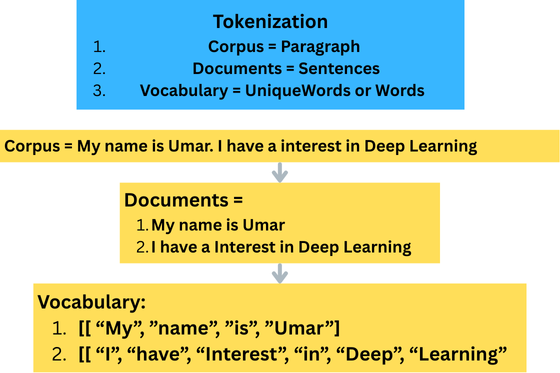

# NLP
# 🧠 Natural Language Processing (NLP) Roadmap

---

---

## 📌 Part 1: Text Preprocessing using NLTK

### 🔹 Techniques Covered
- Tokenization
- Stemming (Porter, Regexp, Snowball)
- Lemmatization (WordNet)
- Stop Words Removal

---

### 1. 🔸 Tokenization
> Breaking down sentences into individual tokens (words or phrases).

---

### 2. 🔸 Stemming
> Reducing words to their root form.

| Stemmer Type       | Description                                         |
|--------------------|-----------------------------------------------------|
| **Porter Stemmer** | Automatic, fast, but lower accuracy                |
| **Regexp Stemmer** | Manual suffix removal, not automatic               |
| **Snowball Stemmer** | Improved accuracy over Porter                    |

---

### 3. 🔸 Lemmatization
> Converts words to their base dictionary form (lemma).

- Uses WordNetLemmatizer
- More accurate than stemming but slightly slower

---

### 4. 🔸 Stop Words Removal
> Removes common, insignificant words (like “is”, “the”, “and”) to focus on meaningful text.

---

## 📌 Part 2: Vectorization Techniques

### 🔹 Techniques Covered
- One Hot Encoding
- Bag of Words
- TF-IDF (Term Frequency - Inverse Document Frequency)

---

### 1. 🔸 One Hot Encoding
> Represents words as binary vectors based on vocabulary index.

**Limitations:**
- Prone to **OOV (Out Of Vocabulary)** errors
- Does **not capture semantic meaning**

---

### 2. 🔸 Bag of Words
> Represents text by the frequency of words in a document.

*🖼️ Add Bag of Words diagram here*

---

### 3. 🔸 TF-IDF (Term Frequency-Inverse Document Frequency)
> Weights the word frequency by how unique a word is across documents.

*🖼️ Add TF-IDF illustration here*

---

## 🚀 Part 3: Deep Learning for NLP *(Coming Soon)*

- 🔄 **RNN (Recurrent Neural Networks)**
- 🔁 **LSTM (Long Short-Term Memory)**
- 🔃 **Bidirectional LSTM**
- 🔤 **Word Embeddings (Word2Vec, GloVe)**
- 🧠 **Transformer models (optional)**

---

### 🔄 1. Recurrent Neural Networks (RNN)

> RNNs are designed for sequential data. They maintain a hidden state that captures information from previous time steps, making them suitable for tasks like sentiment analysis and text generation.

**Limitations:**
- Struggles with long sequences due to vanishing gradients
- Hard to capture long-term dependencies

---

### 🔁 2. Long Short-Term Memory Networks (LSTM)

> LSTM is a type of RNN that solves the vanishing gradient problem using memory cells and gates (input, forget, and output gates).

**Advantages:**
- Retains long-term dependencies
- Widely used in text classification, machine translation, and time-series prediction

---

### 🔃 3. Bidirectional LSTM

> Bidirectional LSTMs process the sequence in both forward and backward directions, providing context from past and future at each time step.

**Use Cases:**
- Named Entity Recognition (NER)
- Question Answering
- Text Summarization

---

### 🔤 4. Word Embeddings – Word2Vec

> Word2Vec is a technique to represent words as dense vectors that capture their semantic meaning. Words with similar context have similar vectors.

#### Two architectures:
- **CBOW (Continuous Bag of Words):** Predicts the current word from surrounding context.
- **Skip-Gram:** Predicts surrounding context given the current word.

**Advantages:**
- Captures semantic similarity  
  (e.g., `"king" - "man" + "woman" ≈ "queen"`)
- Reduces dimensionality and sparsity compared to one-hot or TF-IDF

---

## ✅ Summary

| Technique          | Handles Sequence | Retains Context         | Semantic Understanding |
|--------------------|------------------|--------------------------|-------------------------|
| RNN                | ✅               | ✅ (short-term)          | ❌                      |
| LSTM               | ✅               | ✅ (long-term)           | ❌                      |
| BiLSTM             | ✅               | ✅ (bi-directional)      | ❌                      |
| Word2Vec           | ❌               | ❌                       | ✅                      |
